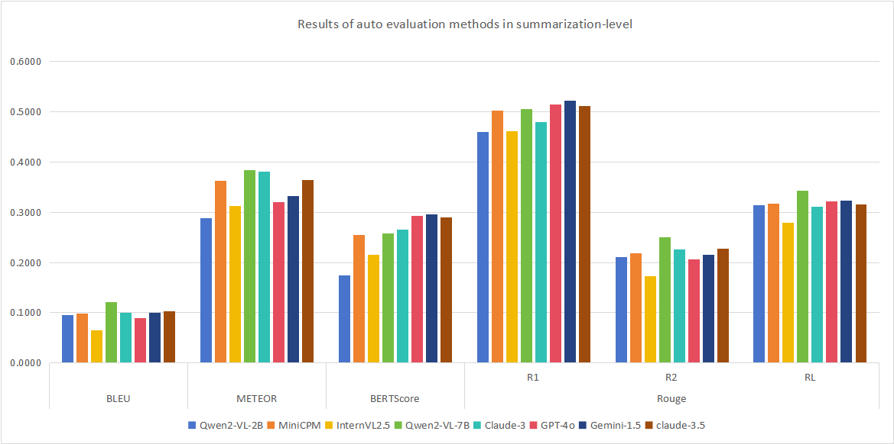
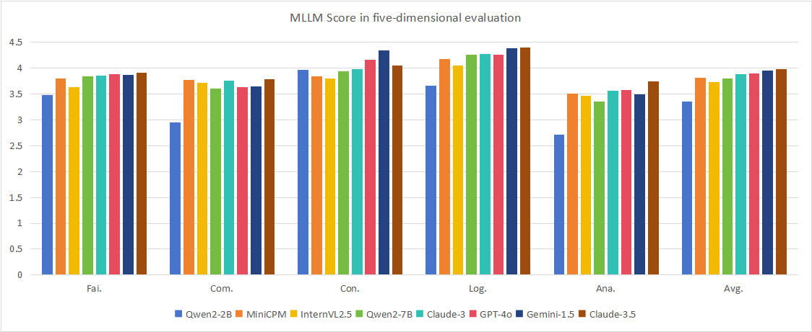

# 📊 AnaFig
🏠[Home](https://github.com/yuetanbupt/AnaFig.github.io/) | *Current Version: v1.0*

This repository contains the code to evaluate models on AnaFig from the paper [AnaFig: A Human-Aligned Dataset for Scientiffc Figure Analysis].

*🤗 We are first-time evaluation suite builders and this codebase is released for the first-time. We are committed to improving it. If you have any questions, feel free to raise issues and/or submit pull requests for new features of bug fixes.*

## 👋 Introduction
Scientiffc Figure Analysis (SFA) aims to derive analytical insights
from ffgures while incorporating background instructions. Unlike
conventional tasks such as ffgure captioning or description generation,
which focus on extracting surface-level information from the
sole visual modality, SFA requires an intelligent system to summarize
 key patterns, infer implications, and contextualize scientiffc
ffndings from visual and textual inputs. It demands not only visual
recognition but also the integration of scientiffc knowledge, multimodal
understanding, and contextual reasoning. In this work, we
introduce an SFA dataset, AnaFig, comprising 2,000 high-quality
samples across 56 domains. All samples are evaluated by using
human-aligned ffve-dimensional scoring criteria, resulting 10,000
human-annotated score labels. The AnaFig dataset facilitates the assessment
of three critical capabilities of multimodal large language
models (MLLMs): adherence to complex instructions, multimodal
perception, and analytical summarization. By building a new benchmark
 with widely used MLLMs, this study contributes to scientiffc
knowledge discovery and reasoning, fostering the alignment of
MLLMs and human experts in scientiffc analysis.



## 🛠️ Evaluate Your Models
### Setup
Download the images:
```
git clone https://github.com/yuetanbupt/AnaFig.git
cd images
wget https://xxxxxxxxxxxxxxxxxxxxxx
unzip images.zip && rm images.zip
```

<details>
<summary>  (Optional) A short tour for the codebase </summary>  

* `data` folder contains all QAs and metadata for images, descriptive questions, and reasoning questions.  
* `images` folder contains all images. Note that there are only  xxxxx images in total.  
* `output` folder contains all response generation and scoring results.  
* `model` folder contains all the model code used to generate anaFig responses.  
* `eval_method`  folder contains the Python code file for all evaluation methods.

</details>

### Response generation
Before using the model to generate responses to chart-question pairs, anaFig requires configuring a Python runtime environment, which can be set up by executing `pip install -r requirements.txt`. Responses are generated using queries as input, which contain all the charts and questions that anaFig uses to evaluate models. The structure is as follows:
```js
{
    "0": {
        "figure1": ...<str>,
        "label1": ...<str>,
        "caption1": ...<str>,
        "text": ...<str>,
        "summarize_figure": ...<str>,
        "summarization": ...<str>,
    },
    "1": {
        "figure1": ...<str>,
        "label1": ...<str>,
        "caption1": ...<str>,
        "text": ...<str>,
        "summarize_figure":...<str>,
        "summarization": ...<str>,
    },
    ...
}
```

If you are using an `API` to call a closed-source model, first ensure that the selected model has the ability to `process images`. You can directly run `API_gen.py` and input the `API link` and `secret key`. If you are using a local open-source model, ensure that the model can handle `interleaved text and image inputs`. For specific implementation, please refer to `model/Qwen2-VL-7B.py`.

```bash
python model/API_gen.py \
    --dataSet_name $dataSet_name \
    --api_link $api_link \
    --model_name $model_name \
    --api_key $openai_key
```

```bash
python model/Qwen2-VL-7B.py \
    --dataSet_name $dataSet_name
```

⚠️**The all arguments are required and you should not delete them**. It is your responsibility to ensure the correctness and integrity of the evaluation pipeline if you change them. In particular,

* `--dataSet_name` is used to select the dataset to be used, including `"CS400"`, `"FIG100"`, `"FIG500"`, and `"physics_optics1000"`. Datasets can also be used in combination by placing the concatenated datasets in the `data/`.

* `--api_link` the link to the API of the closed-source model you are using.
* `--api_key` the API key of the closed-source model you are using.

* `--model_name` the exact model name of the closed-source model you are using.


🗄️ Once the process ends, you will find a file in `output/summarization_pre` folder named:
`<data_name>_<model_name>_gen.json`. This file stores your model's responses.


### Evaluation
You can choose to score the generated responses using either the automatic evaluation methods in the `eval_method/` folder or the MLLM scoring methods.

```bash
python model/score-BLEU.py \
    --file_name $file_name \
```
```bash
python model/API_eval.py \
    --file_name $file_name \
    --api_link $api_link \
    --model_name $model_name \
    --api_key $openai_key
```

⚠️**The all arguments are required and you should not delete them**. It is your responsibility to ensure the correctness and integrity of the evaluation pipeline if you change them. In particular,

* `--file_name` is used to select the data with summaries generated by  models stored in the folder output/summariaztion_pre/.


🗄️ Once the process ends, the console will print the average value of the evaluation methods used, and you will find a file in  folder   `output/score/` named: `<file_name>-<eval_method>_score.json`. This file stores your model's evaluation results graded by the automatic evaluation methods or LLMS.

## 📅 Results from Existing Models
We release full results on the validation set (i.e., generated responses, grading done by LLMs and the aggregated stats) for all models we tested in our [github](https://huggingface.co/datasets/princeton-nlp/CharXiv/tree/main/existing_evaluations). If you are interested in doing some fine-grained analysis on these results or calculate some customized metrics, feel free to use them.

## 🏆 Benchmark Results

Results of various evaluation methods in summarization-level.


| Model      | BLEU   | MET.   | BERT Score | ROUGE R1 | ROUGE R2 | ROUGE RL | MLLM Score |
|------------|--------|--------|------------|----------|----------|----------|------------|
| Qwen2-2B   | 0.0954 | 0.2878 | 0.1750     | 0.4605   | 0.2103   | 0.3135   | 3.36       |
| MiniCPM    | 0.0991 | 0.3621 | 0.2550     | 0.5026   | 0.2180   | 0.3165   | 3.82       |
| InterVL2.5 | 0.0645 | 0.3126 | 0.2154     | 0.4618   | 0.1728   | 0.2792   | 3.73       |
| Qwen2-7B   | 0.1214 | 0.3846 | 0.2585     | 0.5051   | 0.2509   | 0.3423   | 3.80       |
| Claude-3   | 0.1003 | 0.3810 | 0.2654     | 0.4792   | 0.2252   | 0.3106   | 3.89       |
| GPT-4o     | 0.0893 | 0.3204 | 0.2931     | 0.5148   | 0.2067   | 0.3218   | 3.90       |
| Gemini-1.5 | 0.0993 | 0.3330 | 0.2960     | 0.5222   | 0.2159   | 0.3228   | 3.95       |
| Claude-3.5 | 0.1024 | 0.3645 | 0.2903     | 0.5114   | 0.2274   | 0.3153   | 3.98       |

## 📜 License
Our original data contributions are distributed under the MIT license.

## 🙌 Contributors and Acknowledgement
**📊 AnaFig is developed by a team consisting of:**  
Yue Tan, Xuzhao Shi, Rui Mao, Zilong Song, Zonghai Hu, Dongyan Zhao
Email to yuetan@pku.edu.cn
WICT, Peking University
Beijing University of Posts and Telecommunications
Nanyang Technological University

🤗 We sincerely appreciate the open-source community for their valuable resources. The dataset construction process benefited from the academic paper retrieval tools provided by ArXiv, which facilitated the collection of figure samples across multiple domains. Special thanks also go to the contributors of open-source annotation tools, whose work improved the efficiency and quality of our human annotation process.

🤗 Additionally, we acknowledge the support from the State Key Laboratory of General Artificial Intelligence (SKLGAI), which provided crucial computational resources and academic guidance for this research.
