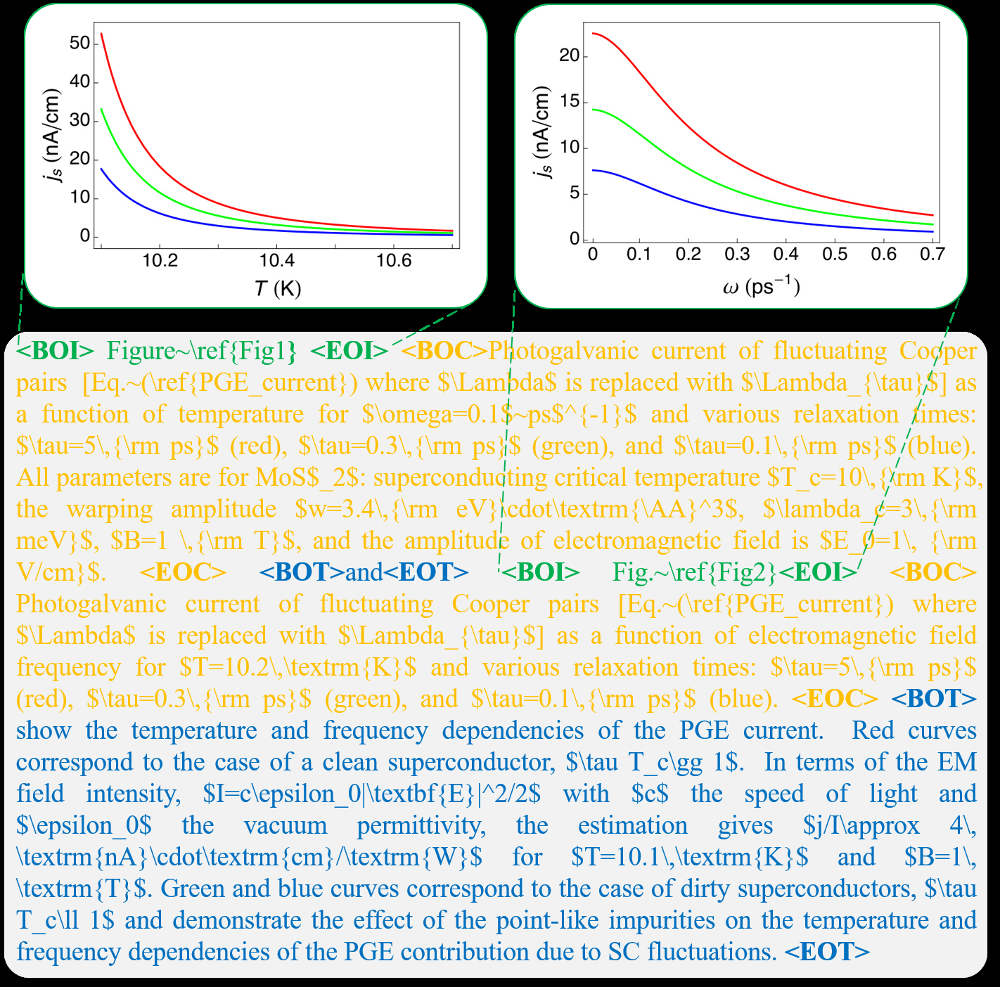
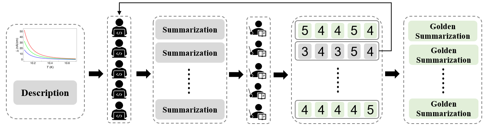
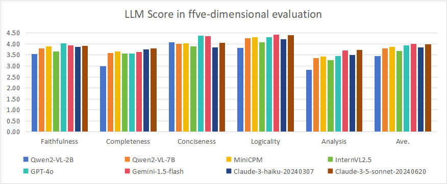

# AnaFig: A Human-Aligned Dataset for Scientiffc Figure Analysis 
## introduction
AnaFig is an open-source dataset and benchmark toolkit dedicated to **Scientific Figure Analysis (SFA)**, designed to advance the analytical capabilities of Multimodal Large Language Models (MLLMs) in scientific domains. This project provides high-quality annotated data, a robust evaluation framework, and benchmarking tools to help researchers train and assess models' abilities in semantic understanding, logical reasoning, and analytical summarization of complex scientific figures.  


### Core Features  
#### 1. High-Quality Multimodal Dataset  
- **Data Scale**: Contains 1,000 samples across 8 subfields of physics, each comprising a figure, caption, and contextual text (with multi-figure inputs supported in some samples).  
- **Data Format**: Adopts a modality-separated input structure with special tokens (e.g., `<BOI>...</BOI>` for figures, `<BOC>...</BOC>` for captions, and `<BOT>...</BOT>` for context) to facilitate multimodal processing by models.  
- **Annotation Quality**: Curated through multiple rounds of expert annotation and review by 10 physics experts, with each sample accompanied by human ratings  across 5 dimensions: Faithfulness, Completeness, Conciseness, Logicality, and Depth of Analysis, ensuring professional and reliable annotations .  

#### 2. Five-Dimensional Evaluation Framework  
- **Evaluation Dimensions**:  
  - **Faithfulness**: Assesses whether summaries strictly adhere to figure and text information.  
  - **Completeness**: Checks for comprehensive coverage of key data trends and patterns.  
  - **Conciseness**: Measures freedom from redundant information, focusing on core insights.  
  - **Logicality**: Verifies alignment with scientific logic and domain knowledge.  
  - **Depth of Analysis**: Evaluates the ability to go beyond surface descriptions and provide insightful interpretations .  
- **Scoring Criteria**: Each dimension is rated on a 1–5 scale, with all samples iteratively refined to ensure final scores ≥4. The dataset includes 5,000 rating labels .  

#### 3. Benchmark Testing Tools  
- **Model Support**: Includes test scripts for MLLMs (e.g., Qwen2-VL, Claude-3, Gemini-1.5) with support for zero-shot evaluation.  
- **Evaluation Metrics**: Combines automatic metrics (BLEU, ROUGE, BERTScore) and human-aligned LLM scoring to comprehensively measure summary quality .  
- **Ablation Study Tools**: Provides contrastive testing by removing contextual text to validate the impact of scientific background knowledge on model performance .  


## Project Structure  
```
AnaFig/
├─data              # Holds dataset - related data.
│ └─img             # Stores image files within the dataset.
├─eval_method       # Contains files/scripts for evaluation methods.
├─example_image     # Stores sample images for demonstration.
├─model             # Stores model - related files like configurations and weights.
└─output            # Holds model - generated output.
├─LLM_score         # Stores scores given by Large Language Models.
└─summarization_pre # Stores generated summary predictions.
```  
## Image Data
Please download image data to data/img from link:https://..................................................

## Requirements
* Python 3.10+
* Pytorch 2.0+
* CUDA 11.8+(☆ Required for GPU acceleration)
* API for proprietary models' services(such as GPT)

## Quick Start  
### 1. Environment SetUup
```python  
# Install dependencies
pip install-r requirements.txt

# Set API key(in ~/.bashrc or system enviroonment)
export API_KEY = "your_api_key_here"
```  
### 2. Main Module
#### 2.1 summarization generation
```bash 
 python Qwen2-VL-2B.py
```  
* Load the dataset and input it into the large model Qwen2-VL-2B in an interleaved figure-text format.
* Save the summary predictions from the Qwen2-VL-2B large model to output/summarization_pre/Qwen2-VL/.
* The process for generating summarization with other large models (Qwen2-VL-7B, MiniCPM, InternVL2.5, GPT-4o, Gemini-1.5-flash, Claude-3.5-sonnet, Claude-3-haiku) uses the same method.
#### 2.2 Get score
##### 2.2.1 Score via automatic metrics 
```bash  
python score-BLEU.py
* Compare the summaries generated by large models with reference summaries and score them.
* Output the average score in the console.
* The same method applies to other automated scoring methods (Bertscore, Meteor, Rouge).
```  
##### 2.2.1 Score via MLLMs
```bash  
python score-LLM.py
```  
* Use Gemini-1.5-flash to score the summarization generated by large models based on the context and reference summarization.
* Save the scoring results to output/LLM_score/.

## Contact Us
Email to yuetan@pku.edu.cn
