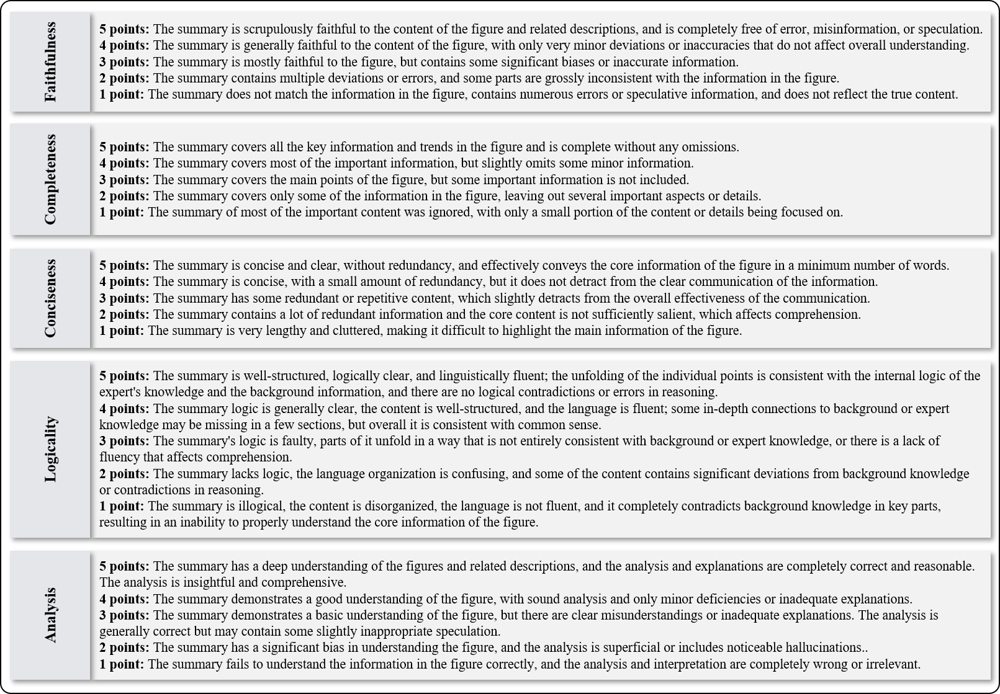

# 📊 AnaFig
🏠 *Current Version: v1.0*

This repository contains the code to evaluate models on AnaFig from the paper [AnaFig: A Human-Aligned Dataset for Scientific Figure Analysis].

*🤗 This codebase is released as Version v1.0. We are dedicated to its continuous improvement. If you have any questions or suggestions, you are welcome to open an issue or submit a pull request for new features or bug fixes.*

## 👋 Introduction
Scientific Figure Analysis (SFA) aims to derive analytical insights
from figures while incorporating background instructions. Unlike
conventional tasks such as figure captioning or description generation,
which focus on extracting surface-level information from the
sole visual modality, SFA requires an intelligent system to summarize
 key patterns, infer implications, and contextualize scientific
findings from visual and textual inputs. It demands not only visual
recognition but also the integration of scientific knowledge, multimodal
understanding, and contextual reasoning. In this work, we
introduce an SFA dataset, AnaFig, comprising 2,000 high-quality
samples across 56 domains. All samples are evaluated by using
human-aligned five-dimensional scoring criteria, resulting 10,000
human-annotated score labels. The AnaFig dataset facilitates the assessment
of three critical capabilities of multimodal large language
models (MLLMs): adherence to complex instructions, multimodal
perception, and analytical summarization. By building a new benchmark
 with widely used MLLMs, this study contributes to scientific
knowledge discovery and reasoning, fostering the alignment of
MLLMs and human experts in scientific analysis.


## 📊 Dataset Details

<p align="center">
  
  
</p>

The AnaFig dataset is constructed from academic papers, including 10 major domains and 56 sub-domains. All data are collected from an open access academic website. We filter out figures with low resolution or poor image quality. To ensure data diversity, we manually remove specific types of figures, such as flowcharts, and sample schematics. Finally, we retain 2,000 high-quality samples cover 18 figure types, selected from over 6,000 academic papers. The 2,000 samples comprise 2155 figures, 2155 figure captions, and 2000 descriptive contexts, referring to the figures in the papers (note that a sample may include multiple figures and their corresponding captions).




The gold-standard summaries in our AnaFig dataset are meticulously crafted by ten human experts (graduate students or researchers with PhD degrees). We leverage an annotation-evaluation-refinement process to ensure the quality of generated summaries. Five experts serve as initial annotators, generating summaries based on our established annotation criteria. Next, the other five experts act as checkers, independently evaluating and scoring all 2,000 data samples. We use five-dimensional evaluation criteria, e.g., faithfulness, completeness, conciseness, logicality, and analysis. **Faithfulness:** The summary must strictly adhere to the information presented in the figures and descriptions. **Completeness:** The summary should encompass all key information and trends depicted in the figures. **Conciseness:** The summary should avoid redundant information or non-critical details. **Logicality:** The summarized content should be logically coherent and consistent with common sense and expert knowledge. **Analysis:** The summary's analysis should be insightful and demonstrate a thorough understanding of the data. Checkers assign scores from 1 to 5 for each criterion. Summaries scoring 3 or lower on any dimension are iteratively revised until all samples achieve a score of 4 or higher across all five dimensions.

## 🛠️ Evaluate Your Models
### Setup
Download the images:
```
git clone https://github.com/yuetanbupt/AnaFig.git
cd images
wget -O AnaFig-image.zip https://drive.usercontent.google.com/download?id=1szWDGkZXbw67u9WGy_qrs8GNjRaiFFPg&export=download&confirm=t&uuid=8222368e-2802-4aea-8f99-3a30237bfc8a
unzip AnaFig-image.zip && rm AnaFig-image.zip
```
(Alternative) Download image data from link: https://drive.google.com/file/d/1szWDGkZXbw67u9WGy_qrs8GNjRaiFFPg/view?usp=sharing

### Summary generation
Before using the model to generate summary to chart-question pairs, anaFig requires configuring a Python runtime environment, which can be set up by executing `pip install -r requirements.txt`. Responses are generated using queries as input, which contain all the charts and questions that anaFig uses to evaluate models. The structure is as follows:
```js
{
    "0": {
        "figure1": ...<str>,
        "label1": ...<str>,
        "caption1": ...<str>,
        "context": ...<str>,
        "target_figure": ...<str>,
        "summary": ...<str>,
    },
    "1": {
        "figure1": ...<str>,
        "label1": ...<str>,
        "caption1": ...<str>,
        "context": ...<str>,
        "target_figure":...<str>,
        "summary": ...<str>,
    },
    ...
}
```

If you are using an `API` to call a closed-source model, first ensure that the selected model has the ability to `process images`. You can directly run `API_gen.py` and input the `api link` and `api key`. If you are using a local open-source model, ensure that the model can handle `interleaved text and image inputs`. For specific implementation, please refer to `model/Qwen2-VL-7B_gen.py`.

```bash
python model/API_gen.py \
    --api_link $api_link \
    --model_name $model_name \
    --api_key $openai_key
```

```bash
python model/Qwen2-VL-7B_gen.py 
```

⚠️**The all arguments are required and you should not delete them**. It is your responsibility to ensure the correctness and integrity of the evaluation pipeline if you change them. In particular,

* `--api_link` the link to the API of the closed-source model you are using.
* `--api_key` the API key of the closed-source model you are using.

* `--model_name` the exact model name of the closed-source model you are using.


🗄️ Once the process ends, you will find a file in `output/summary_pre/` folder named:
`<model_name>_gen.json`. This file stores your model's responses.


### Evaluation
You can choose to score the generated responses using either the automatic evaluation methods in the `eval_method/` folder or the MLLM scoring methods.

```bash
python model/summary_bleu_score.py \
    --file_name $file_name \
```
```bash
python model/API_eval.py \
    --file_name $file_name \
    --api_link $api_link \
    --model_name $model_name \
    --api_key $openai_key
```

⚠️**The all arguments are required and you should not delete them**. It is your responsibility to ensure the correctness and integrity of the evaluation pipeline if you change them. In particular,

* `--file_name` is used to select the data with summaries generated by  models stored in the folder `output/summary_pre/`.


🗄️ Once the process ends, the console will print the average value of the evaluation methods used, and you will find a file in  folder   `output/score/` named: `<file_name>-<model_name>_score.json`. This file stores your model's evaluation results graded by the automatic evaluation methods or LLMS.

## 🏆 Benchmark Results

Results of various evaluation methods in summarization-level.


| Model      | BLEU   | MET    | BERT Score | ROUGE R1 | ROUGE R2 | ROUGE RL | MLLM Score |
|------------|--------|--------|------------|----------|----------|----------|------------|
| Qwen2-2B   | 0.0954 | 0.2878 | 0.1750     | 0.4605   | 0.2103   | 0.3135   | 3.36       |
| MiniCPM    | 0.0991 | 0.3621 | 0.2550     | 0.5026   | 0.2180   | 0.3165   | 3.82       |
| InterVL2.5 | 0.0645 | 0.3126 | 0.2154     | 0.4618   | 0.1728   | 0.2792   | 3.73       |
| Qwen2-7B   | 0.1214 | 0.3846 | 0.2585     | 0.5051   | 0.2509   | 0.3423   | 3.80       |
| Claude-3   | 0.1003 | 0.3810 | 0.2654     | 0.4792   | 0.2252   | 0.3106   | 3.89       |
| GPT-4o     | 0.0893 | 0.3204 | 0.2931     | 0.5148   | 0.2067   | 0.3218   | 3.90       |
| Gemini-1.5 | 0.0993 | 0.3330 | 0.2960     | 0.5222   | 0.2159   | 0.3228   | 3.95       |
| Claude-3.5 | 0.1024 | 0.3645 | 0.2903     | 0.5114   | 0.2274   | 0.3153   | 3.98       |

## 📜 License
Our original data contributions are distributed under the MIT license.

## 🙌 Contributors and Acknowledgement
**AnaFig is developed by a team consisting of:**  
Yue Tan, Xuzhao Shi, Rui Mao, Zilong Song, Zonghai Hu, Dongyan Zhao
Email to yuetan@pku.edu.cn
WICT, Peking University
Beijing University of Posts and Telecommunications
Nanyang Technological University

🤗 We sincerely appreciate the open-source community for providing valuable resources. The dataset construction process benefited from academic paper retrieval tools offered by arXiv, which facilitated the collection of figure samples across multiple domains. We also extend special thanks to the developers of open-source annotation tools, whose contributions significantly enhanced the efficiency and quality of our human annotation process.

🤗 Additionally, we acknowledge the support from the State Key Laboratory of General Artificial Intelligence (SKLGAI), which provided crucial computational resources and academic guidance for this research.
